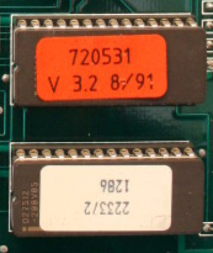
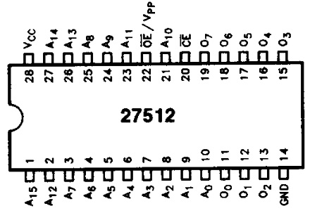
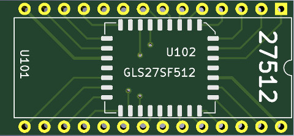
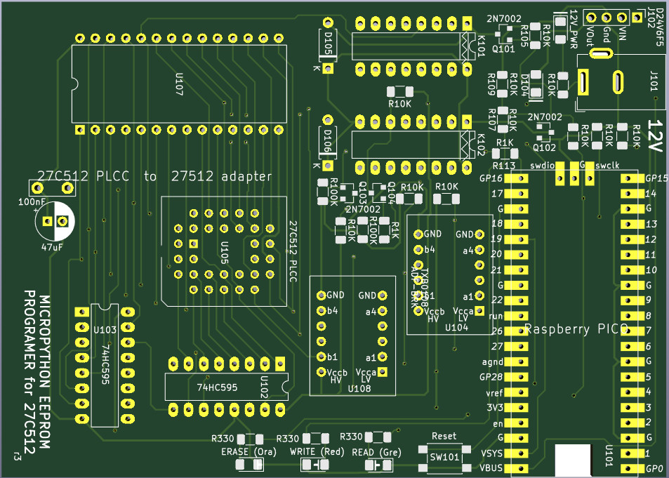
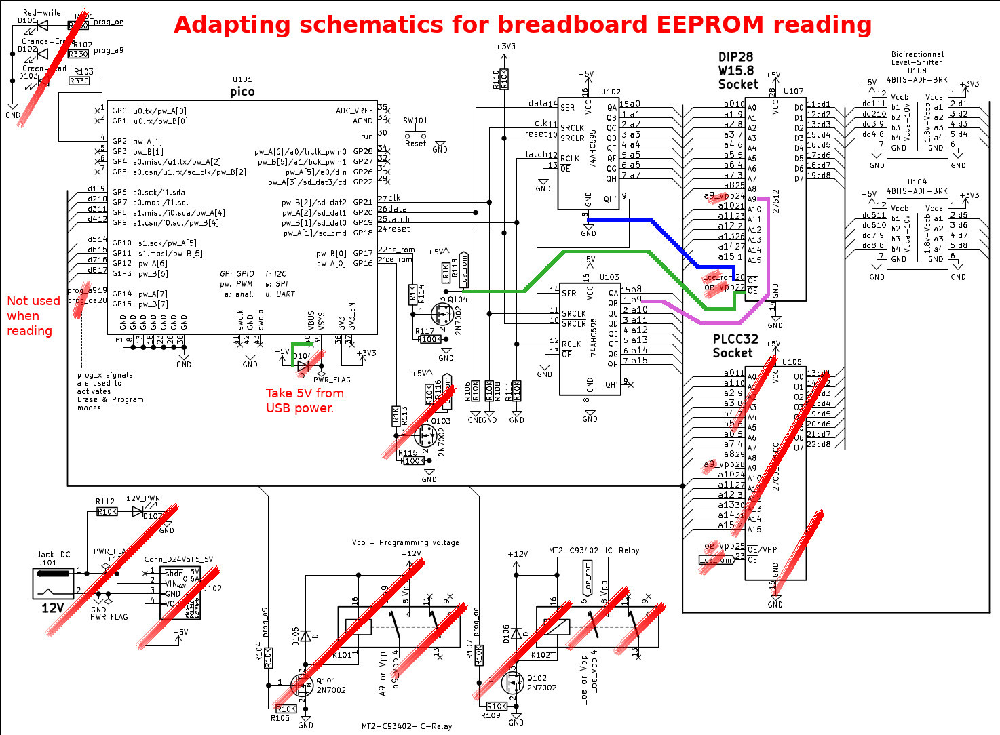
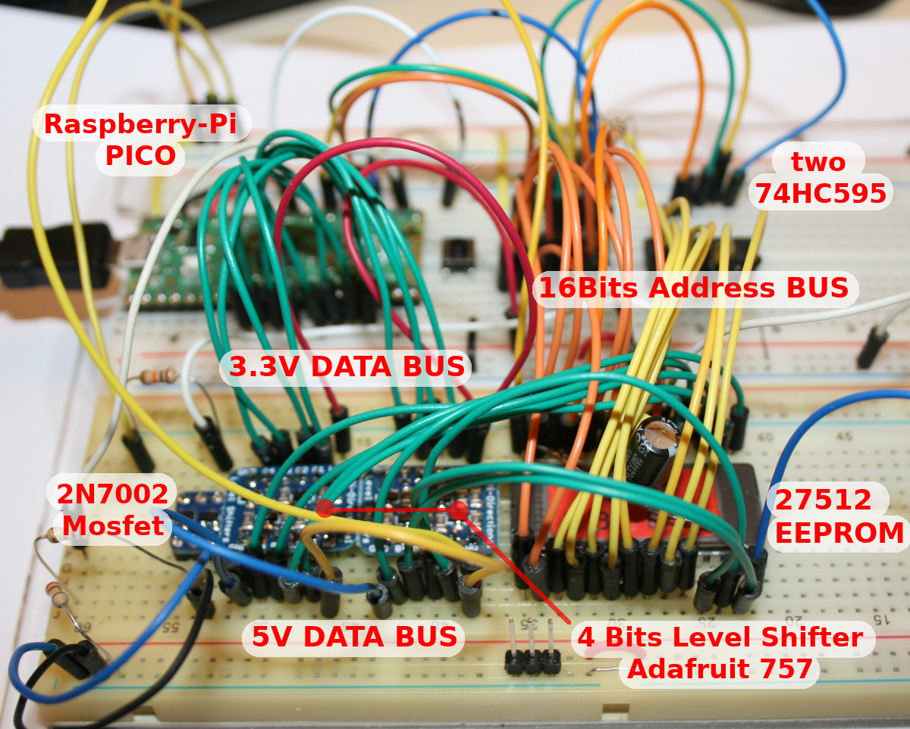
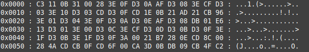
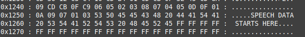

# 27C512 EEProm programmer with MicroPython

## Abstract
A while ago I did start a project to convert a DTMF Central processor board (Z80 based) to something usable in retro-programming.

Have a look to the following links for more informations on that project:
* [Project presentation on System-cfg.com forums](https://forum.system-cfg.com/viewtopic.php?f=18&t=14526)
* Boards retro-engineering [kicad-public-projects/HASKEL-Z80](https://github.com/mchobby/kicad-public-projects/tree/main/HASKEL-Z80) repository

The projet use 27512 UVPROMs (UV Erasable, 64KBytes) with the existing Z80 software.

 

As I do not have required material, I decided to replace them with [GLS27SF512 EEPROM](https://www.mouser.be/ProductDetail/Greenliant/GLS27SF512-70-3C-NHE?qs=bAdOcXfFoy2PEE%252BGIrqMmw%3D%3D) from Greenliant together with small [GLS27SF512 to 27512 adapter board](https://github.com/mchobby/kicad-public-projects/tree/main/HASKEL-Z80/EPROM-27512-GLS27SF512).



## A MicroPython EEProm programmer

So I need something to manipulate the EEPROM of my project. As I do not have any device for my Linux Machine, I will create my own one around a [Raspberry-Pi Pico](https://shop.mchobby.be/en/pico-rp2040/2025-pico-rp2040-2-cores-microcontroler-from-raspberry-pi-3232100020252.html) and [MicroPython](https://micropython.org).

The idea is to create a solution to:
1. Read an 27512 UVEprom  
2. Read and Write an GLS27SF512 EEPROM



# Library

The library must be copied to the MicroPython board before using the examples.

On a WiFi based microcontroler:

 ```
 >>> import mip
 >>> mip.install("github:mchobby/micropython-eeprom-27512")
 ```

 Or by using the mpremote tool:

 ```
 mpremote mip install github:mchobby/micropython-eeprom-27512
 ```

# Wiring

The __FULL SCHEMATIC__ is available on the [kicad-public-projects/HASKEL-Z80/PROGRAMMER-GLS27SD512](https://github.com/mchobby/kicad-public-projects/tree/main/HASKEL-Z80/PROGRAMMER-GLS27SF512/docs) repository


# Testing

## Reading EEPROM

I did used a simplified schematic to breadboard it! As it only does reading this should not be a problem to access the EEPROM (_the programmer boards are not received yet_)



Which does look like the following with the EEPROM to read at bottom-right of my breadboard.



The example [read_epprom.py](examples/read_epprom.py) just read the 64K eeprom content and display it on the REPL output.

See the variable `start_addr` and `end_addr` in the script [read_epprom.py](examples/read_epprom.py) to modify the range of reading

```
start_addr = 0x0000
end_addr   = 0xFFFF
```

When running the script, we got the following on the REPL session (partial results):



Surprisingly the ROM from 1991 does contains some speech data!



The full content is made available in the [examples/ROM1.txt](examples/ROM1.txt) file (~380 Kio).

## Reading EEPROM to file

It is possible to redirect the content of REPL output to a file thanks to MicroPython's `mpremote` official tool.

The following shell statement asks __mpremote__ to execute the computer local file `read_eeprom.py` on the target micropython MCU then collect the REPL output to store them into the `ROM1.txt` file (on the computer, of course)  

`$ mpremote run read_eeprom.py > ROM1.txt`
