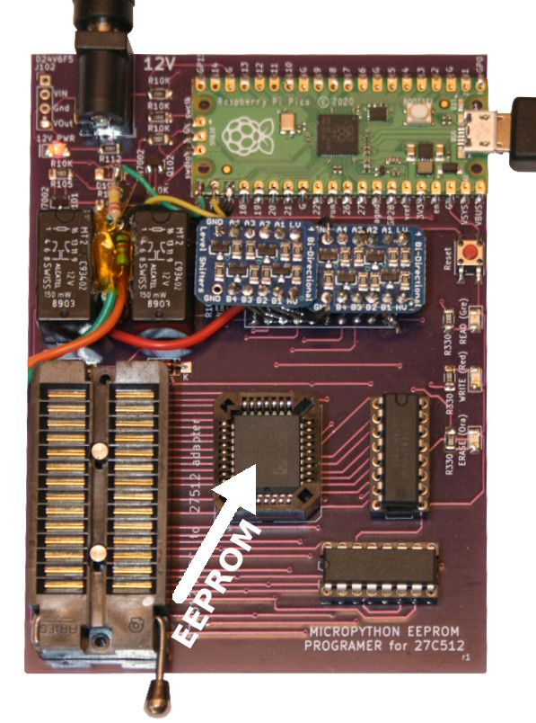
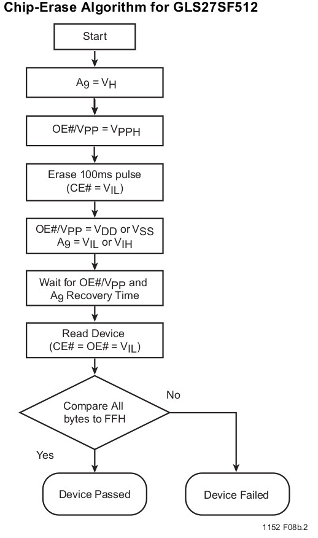
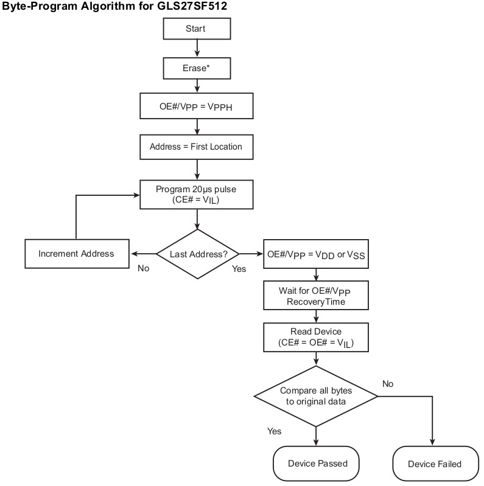

# 27C512 EEProm programmer with MicroPython

## Abstract
A while ago I did start a project to convert a DTMF Central processor board (Z80 based) to something usable in retro-programming.

Have a look to the following links for more informations on that project:
* [Project presentation on System-cfg.com forums](https://forum.system-cfg.com/viewtopic.php?f=18&t=14526)
* Boards retro-engineering [kicad-public-projects/HASKEL-Z80](https://github.com/mchobby/kicad-public-projects/tree/main/HASKEL-Z80) repository

The projet use 27512 UVPROMs (UV Erasable, 64KBytes) with the existing Z80 software.

 

As I do not have required material, I decided to replace them with [GLS27SF512 EEPROM](https://www.mouser.be/ProductDetail/Greenliant/GLS27SF512-70-3C-NHE?qs=bAdOcXfFoy2PEE%252BGIrqMmw%3D%3D) from Greenliant together with small [GLS27SF512 to 27512 adapter board](https://github.com/mchobby/kicad-public-projects/tree/main/HASKEL-Z80/EPROM-27512-GLS27SF512).


## A MicroPython EEProm programmer

So I need something to manipulate the EEPROM of my project. As I do not have any device for my Linux Machine, I will create my own one around a [Raspberry-Pi Pico](https://shop.mchobby.be/en/pico-rp2040/2025-pico-rp2040-2-cores-microcontroler-from-raspberry-pi-3232100020252.html) and [MicroPython](https://micropython.org).

The idea is to create a solution to:
1. Read an 27512 UVEprom  
2. Read and Write an GLS27SF512 EEPROM


# Library

The library must be copied to the MicroPython board before using the examples.

On a WiFi based microcontroler:

 ```
 >>> import mip
 >>> mip.install("github:mchobby/micropython-eeprom-27512")
 ```

 Or by using the mpremote tool:

 ```
 mpremote mip install github:mchobby/micropython-eeprom-27512
 ```

# Wiring

The __FULL SCHEMATIC__ is available on the [kicad-public-projects/HASKEL-Z80/PROGRAMMER-GLS27SD512](https://github.com/mchobby/kicad-public-projects/tree/main/HASKEL-Z80/PROGRAMMER-GLS27SF512/docs) repository


# Testing

## Reading EEPROM

I did used a simplified schematic to breadboard it! As it only does reading this should not be a problem to access the EEPROM (_the programmer boards are not received yet_)


Which does look like the following with the EEPROM to read at bottom-right of my breadboard.


The example [read_epprom.py](examples/read_epprom.py) just read the 64K eeprom content and display it on the REPL output.

See the variable `start_addr` and `end_addr` in the script [read_epprom.py](examples/read_epprom.py) to modify the range of reading

```
start_addr = 0x0000
end_addr   = 0xFFFF
```

When running the script, we got the following on the REPL session (partial results):


Surprisingly the ROM from 1991 does contains some speech data!


The full content is made available in the [examples/ROM1.txt](examples/ROM1.txt) file (~380 Kio).

## Reading EEPROM to file

It is possible to redirect the content of REPL output to a file thanks to MicroPython's `mpremote` official tool.

The following shell statement asks __mpremote__ to execute the computer local file `read_eeprom.py` on the target micropython MCU then collect the REPL output to store them into the `ROM1.txt` file (on the computer, of course)  

`$ mpremote run read_eeprom.py > ROM1.txt`

## Writing EEProm

The [write_eeprom.py](examples/write_eeprom.py) example was use to repitively write one kilo-byte of predefined data into the 64 Kio EEPROM.

This was conduct on the first release of the board published on the [kicad-public-projects/HASKEL-Z80/PROGRAMMER-GLS27SD512](https://github.com/mchobby/kicad-public-projects/tree/main/HASKEL-Z80/PROGRAMMER-GLS27SF512/docs) repository.

As shown on the picture here below, the board also include some updates fixing issue on the board for having 5V `oe_rom` & `ce_rom` signals (also published on the [kicad-public-projects/HASKEL-Z80/PROGRAMMER-GLS27SD512](https://github.com/mchobby/kicad-public-projects/tree/main/HASKEL-Z80/PROGRAMMER-GLS27SF512/docs) repository).



The script execute the following steps:
1. Erase the EEProm
2. Check that EEPROM have only 0xFF data
3. Program EEPROM with the 1 Kio data sample.
4. Re-read EEPROM content (as it is recommended)

Once programmed, I did read back the EEPROM content... showing the expected results:

```
0x0000 : 20 20 5F 5F 20 20 20 20 20 20 5F 20 20 20 20 0D :   __      _    .
0x0010 : 6F 27 27 29 7D 5F 5F 5F 5F 2F 2F 20 20 20 20 0D : o'')}____//    .
0x0020 : 20 60 5F 2F 20 20 20 20 20 20 29 20 20 20 20 0D :  `_/      )    .
0x0030 : 20 28 5F 28 5F 2F 2D 28 5F 2F 20 20 20 20 20 0D :  (_(_/-(_/     .
0x0040 : 20 20 20 20 20 20 20 20 20 20 20 20 20 20 20 0D :                .
0x0050 : 2C 2D 2E 5F 5F 5F 2C 2D 2E 20 20 20 20 20 20 0D : ,-.___,-.      .
0x0060 : 5C 5F 2F 5F 20 5F 5C 5F 2F 20 20 20 20 20 20 0D : \_/_ _\_/      .
0x0070 : 20 20 29 4F 5F 4F 28 20 20 20 20 20 20 20 20 0D :   )O_O(        .
0x0080 : 20 7B 20 28 5F 29 20 7D 20 20 20 20 20 20 20 0D :  { (_) }       .
0x0090 : 20 20 60 2D 5E 2D 27 20 20 20 20 20 20 20 20 0D :   `-^-'        .
0x00A0 : 20 20 20 20 20 20 20 20 20 20 20 20 20 20 20 0D :                .
0x00B0 : 20 20 20 7C 5C 7C 5C 20 20 20 20 20 20 20 20 0D :    |\|\        .
0x00C0 : 20 20 2E 2E 20 20 20 20 5C 20 20 20 20 20 20 0D :   ..    \      .
0x00D0 : 6F 2D 2D 20 20 20 20 20 5C 5C 20 20 20 20 2F 0D : o--     \\    /.
0x00E0 : 20 76 5F 5F 2F 2F 2F 5C 5C 5C 5C 5F 5F 2F 20 0D :  v__///\\\\__/ .
0x00F0 : 20 20 20 7B 20 20 20 20 20 20 20 20 20 20 20 0D :    {           .
0x0100 : 20 20 20 20 7B 20 20 7D 20 5C 5C 5C 7B 20 20 0D :     {  } \\\{  .
0x0110 : 20 20 20 20 3C 5F 7C 20 20 20 20 20 20 3C 5F 0D :     <_|      <_.
0x0120 : 20 20 20 20 20 20 20 20 20 20 20 20 20 20 20 0D :                .
0x0130 : 41 4D 4F 45 42 41 73 20 20 20 20 20 20 20 20 0D : AMOEBAs        .
0x0140 : 5F 5F 5F 5F 5F 2E 5F 5F 5F 5F 5F 5F 20 20 20 0D : _____.______   .
0x0150 : 20 20 20 20 20 20 20 20 20 20 20 20 20 20 20 0D :                .
0x0160 : 5F 5F 5F 5F 5F 21 5F 5F 5F 5F 5F 5F 20 20 20 0D : _____!______   .
0x0170 : 20 20 20 20 20 20 20 20 20 20 20 20 20 20 20 0D :                .
0x0180 : 5F 5F 5F 5F 5F 2E 7C 5F 5F 5F 5F 5F 20 20 20 0D : _____.|_____   .
0x0190 : 20 20 20 20 20 20 20 20 20 20 20 20 20 20 20 0D :                .
0x01A0 : 5F 5F 5F 2E 2E 2E 2E 2E 2E 2E 5F 5F 20 20 20 0D : ___.......__   .
0x01B0 : 20 20 20 20 20 20 20 20 20 20 20 20 20 20 20 0D :                .
0x01C0 : 5F 5F 5F 5F 5F 2A 5F 5F 5F 5F 5F 5F 20 20 20 0D : _____*______   .
0x01D0 : 20 20 20 20 20 20 20 20 20 20 20 20 20 20 20 0D :                .
0x01E0 : 5F 5F 5F 5F 5F 2E 7A 5F 5F 5F 5F 5F 20 20 20 0D : _____.z_____   .
0x01F0 : 20 20 20 20 20 20 20 20 20 20 20 20 20 20 20 0D :                .
0x0200 : 5F 5F 5F 5F 5F 5F 5F 5F 5F 5F 5F 5F 20 20 20 0D : ____________   .
0x0210 : 20 20 20 20 20 20 20 20 20 20 20 20 20 20 20 0D :                .
0x0220 : 5F 5F 5F 5F 5F 6F 5F 5F 5F 5F 5F 5F 20 20 20 0D : _____o______   .
0x0230 : 20 20 20 20 20 20 20 20 20 20 20 20 20 20 20 0D :                .
0x0240 : 5F 5F 5F 5F 5F 4F 5F 5F 5F 5F 5F 5F 20 20 20 0D : _____O______   .
0x0250 : 20 20 20 20 20 20 20 20 20 20 20 20 20 20 20 0D :                .
0x0260 : 5F 5F 5F 5F 5F 6F 2E 6F 5F 5F 5F 5F 20 20 20 0D : _____o.o____   .
0x0270 : 20 20 20 20 20 20 20 20 20 20 20 20 20 20 20 0D :                .
0x0280 : 5F 5F 5F 5F 5F 2E 2D 2E 5F 5F 5F 5F 20 20 20 0D : _____.-.____   .
0x0290 : 20 20 20 20 20 20 20 20 20 20 20 20 20 20 20 0D :                .
0x02A0 : 5F 5F 5F 5F 5F 2E 3E 5F 5F 5F 5F 5F 20 20 20 0D : _____.>_____   .
0x02B0 : 20 20 20 20 20 20 20 20 20 20 20 20 20 20 20 0D :                .
0x02C0 : 5F 5F 5F 5F 5F 2E 2D 5F 5F 5F 5F 5F 20 20 20 0D : _____.-_____   .
0x02D0 : 20 20 20 20 20 20 20 20 20 20 20 20 20 20 20 0D :                .
0x02E0 : 5F 5F 5F 5F 5F 2E 5F 5F 5F 5F 5F 5F 20 20 20 0D : _____.______   .
0x02F0 : 20 20 20 20 20 20 20 20 20 20 20 20 20 20 20 0D :                .
0x0300 : 5F 5F 5F 5F 5F 27 5F 5F 5F 5F 5F 5F 20 20 20 0D : _____'______   .
0x0310 : 20 20 20 20 20 20 20 20 20 20 20 20 20 20 20 0D :                .
0x0320 : 5F 5F 5F 5F 5F 3A 5F 5F 5F 5F 5F 5F 20 20 20 0D : _____:______   .
0x0330 : 20 20 20 20 20 20 20 20 20 20 20 20 20 20 20 0D :                .
0x0340 : 5F 5F 5F 5F 5F 3A 7E 5F 5F 5F 5F 5F 20 20 20 0D : _____:~_____   .
0x0350 : 20 20 20 20 20 20 20 20 20 20 20 20 20 20 20 0D :                .
0x0360 : 5F 5F 5F 5F 28 2E 29 5F 5F 5F 5F 5F 20 20 20 0D : ____(.)_____   .
0x0370 : 20 20 20 20 20 20 20 20 20 20 20 20 20 20 20 0D :                .
0x0380 : 33 3D 3D 3D 44 5F 5F 2E 5F 5F 5F 5F 20 20 20 0D : 3===D__.____   .
0x0390 : 20 20 20 20 20 20 20 20 20 20 20 20 20 20 20 0D :                .
0x03A0 : 5F 5F 5F 5F 5F 24 2E 5F 5F 5F 5F 5F 20 20 20 0D : _____$._____   .
0x03B0 : 20 20 20 20 20 20 20 20 20 20 20 20 20 20 20 0D :                .
0x03C0 : 20 3A 3A 3A 3A 3A 3A 3A 3A 3A 3A 20 20 20 20 0D :  ::::::::::    .
0x03D0 : 20 3A 3A 3A 3A 3A 3A 3A 3A 3A 3A 20 20 20 20 0D :  ::::::::::    .
0x03E0 : 5F 3A 3A 3A 3A 3A 3A 3A 3A 3A 3A 5F 20 20 20 0D : _::::::::::_   .
0x03F0 : 65 6F 66 20 31 30 32 34 20 62 79 74 65 73 20 0D : eof 1024 bytes .
0x0400 : 20 20 5F 5F 20 20 20 20 20 20 5F 20 20 20 20 0D :   __      _    .
0x0410 : 6F 27 27 29 7D 5F 5F 5F 5F 2F 2F 20 20 20 20 0D : o'')}____//    .
0x0420 : 20 60 5F 2F 20 20 20 20 20 20 29 20 20 20 20 0D :  `_/      )    .
0x0430 : 20 28 5F 28 5F 2F 2D 28 5F 2F 20 20 20 20 20 0D :  (_(_/-(_/     .
0x0440 : 20 20 20 20 20 20 20 20 20 20 20 20 20 20 20 0D :                .
...
```

# Programmer Script (under construction)
The [eeprog.py](eeprog.py) EEProm Programmer script is designed to run autonomously on the board.

It act as a USB-serial command interpreter receiving commands and returning response.

* Commands can be sent after the board request it with a ">" command prompt.
* Command line end with CR/LF (\r\n) or LF (\n).
* Command requesting additionnal data (like programming data) shows a "=" continue prompt.

Any error message start with [ERROR] otherwise

Here are the supported commands:

| Command | Description                                                   |
| ------- | ------------------------------------------------------------- |
| v | Show Welcome message and version. |


# Ressources

## GLS257FS512 datasheet

* [GLS512FS12-datasheet.pdf](docs/GLS27SF512.pdf)

## Erase Chip

The GLS512FS12 can be erased as follow:



## Byte Program Chip

The GLS512FS12 can be programmed as follow:



The datasheet also contains a detailled timing diagram with all the signals changes. This was crucial to make this working properly.
